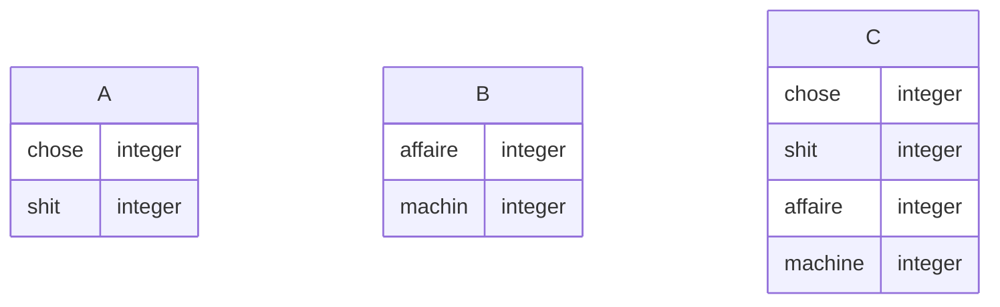
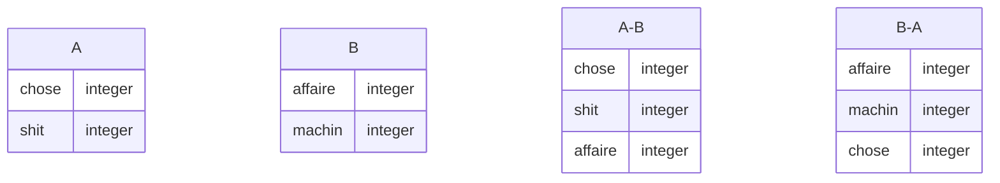

# Généralités et théories

-   Base de données relationelles
-   S.G.B.D (ms access)

## Système de gestion de base de données

-   Stockage de données
-   Naviguer les données
-   Partager les données
-   Cohérence des données
-   Intégrité référencielle
-   Sécurité

# MS Access

## Points fort:

-   Convivial
-   Rapide d'utilisation

## Points faible:

-   Limité en espace
-   Fonctionnalités limités

## Objets:

-   Tables
-   Requetes
-   Formulaires
-   Etats (rapports)
-   Modules (VBA)

# Relations

-   Clé primaire
-   Clé étrangère
-   Cardinalités
-   Erreur d'intégrité référencielle
    -   Suppression en cascade
    -   Modification en cascade

# Algebre relationelle

## Identifier l'opération

### - Union

Union de 2 ensembles d'engregistrements A et B, de meme structure, dans un nouvel ensemble d'enregistrements C.\
C = A U B

### - Intersection
L'intersection entre 2 ensembles d'enregistrements A et B est un ensemble C ou chaque enregistrement n'apparait qu'une seule fois\
C = A n B || C = A intersection B

### - Difference

C'est la difference entre 2 ensembles d'enregistrements A et B\
C = A - B\
C = B - A

### - Produit cartésien
Le produit cartesien de 2 ensembles d'erengistrement D et F est un ensemble d'enregistrements F comportant tous les champs de D et de E.\
F = D x E

### - Jointure interne
Le inner join se fait sur des valeurs egales dans des champs de A et un meme nombres de champs de B.\
A |x| B\
Exemple:\
SELECT AniNom, ClientNom, ClientSolde\
FROM Clients INNER JOIN Animaux ON Clients.[ClientCode] =\ 
Animaux.[AniCodeClient]\
WHERE (((Clients.ClientSolde)))\
\
Autre\

### - Jointure externe

## Effectuer l'opération

# SQL

-   SELECT
    -   INNER JOIN
    -   DISTINCT (retire les doublons)
    -   TOP
-   Fonction d'aggregation (sum(), avg(), count())
    -   GROUP BY
-   Jointures externes
    -   LEFT JOIN
    -   RIGHT JOIN
