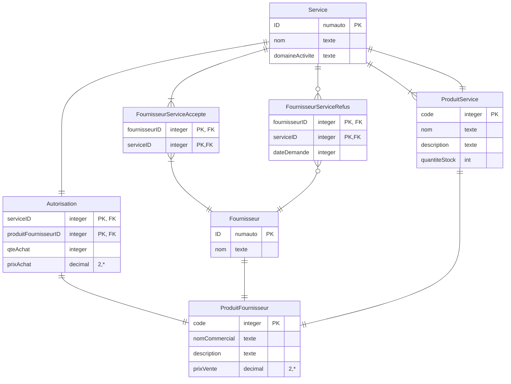

# Numéro 1



# Question 2

```mermaid
erDiagram
  Paiement ||--{| FacturePaiment : ""
  FacturePaiement ||--{| Facture : ""
  Facture ||--|| Commande : ""
  Client ||--o| Commande : ""
  Commande ||--|| CompositionCommande : ""
  CompositionCommande ||--{| Article : ""
  Commande ||--{| CompositionLivraison : ""
  CompositionLivraison ||--{| Article : ""

  Paiement{
    ID numauto PK
    datePaiement integer
    montant decimal "*,2"
  }
  Facture{
    factureID integer PK
    total decimal "*,2"
  }
  FacturePaiement{
    factureNo integer "PK, FK"
    paiementID integer "PK, FK"
  }
  Client{
    clientID numauto PK
    nom texte
  }
  Commande{
    noCommande integer PK
    dateCommande date
    factureNO integer FK
    clientID integer FK
  }
  CompositionCommande{
    noCommande integer "PK, FK"
    articleID integer "PK, FK"
    qteCommandee integer
    prixVente decimal "*,2"
  }
  Article{
    articleID autonum PK
    nom texte
    prix decimal "*,2"
    qteStock integer
    qteSeuil integer
  }
  CompositionLivraison{
    ArticleID integer "PK, FK"
    CommandeNO integer "PK, FK"
    qteLibre integer
    dateLivraision date
  }
```
