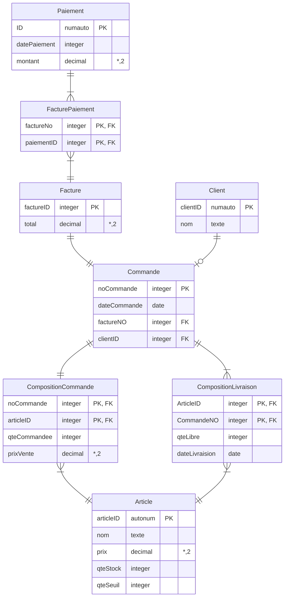
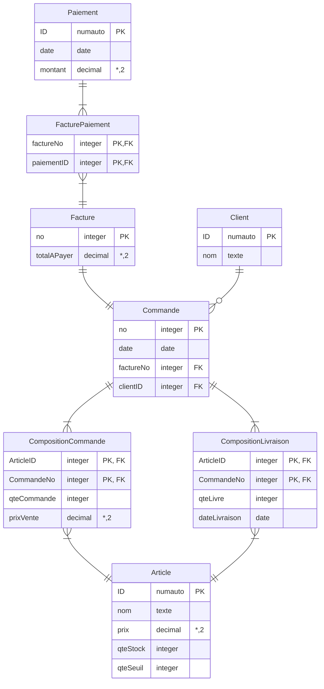

# Question 2

```mermaid
erDiagram
  Paiement ||--|{ FacturePaiement : ""
  FacturePaiement }|--|| Facture : ""
  Facture ||--|| Commande : ""
  Client ||--o| Commande : ""
  Commande ||--|| CompositionCommande : ""
  CompositionCommande }|--|| Article : ""
  Commande ||--|{ CompositionLivraison : ""
  CompositionLivraison }|--|| Article : ""

  Paiement{
    ID numauto PK
    datePaiement integer
    montant decimal "*,2"
  }
  Facture{
    factureID integer PK
    total decimal "*,2"
  }
  FacturePaiement{
    factureNo integer "PK, FK"
    paiementID integer "PK, FK"
  }
  Client{
    clientID numauto PK
    nom texte
  }
  Commande{
    noCommande integer PK
    dateCommande date
    factureNO integer FK
    clientID integer FK
  }
  CompositionCommande{
    noCommande integer "PK, FK"
    articleID integer "PK, FK"
    qteCommandee integer
    prixVente decimal "*,2"
  }
  Article{
    articleID autonum PK
    nom texte
    prix decimal "*,2"
    qteStock integer
    qteSeuil integer
  }
  CompositionLivraison{
    ArticleID integer "PK, FK"
    CommandeNO integer "PK, FK"
    qteLibre integer
    dateLivraision date
  }
```

# Numéro 2

```mermaid
erDiagram
    Paiement ||--|{ FacturePaiement : ""
    FacturePaiement }|--|| Facture : ""
    Facture ||--|| Commande : ""
    Client ||--o{ Commande : ""
    Commande ||--|{ CompositionCommande : ""
    CompositionCommande }|--|| Article : ""
    Commande ||--|{ CompositionLivraison : ""
    CompositionLivraison }|--|| Article : ""
    Paiement {
        ID numauto "PK"
        date date
        montant decimal "*,2"
    }
    Facture {
        no integer "PK"
        totalAPayer decimal "*,2"
    }
    FacturePaiement {
        factureNo integer "PK,FK"
        paiementID integer "PK,FK"
    }
    Commande {
        no integer PK
        date date
        factureNo integer FK
        clientID integer FK
    }
    Client {
        ID numauto PK
        nom texte
    }
    Article {
        ID numauto "PK"
        nom texte
        prix decimal "*,2"
        qteStock integer
        qteSeuil integer
    }
    CompositionCommande {
        ArticleID integer "PK, FK"
        CommandeNo integer "PK, FK"
        qteCommande integer
        prixVente decimal "*,2"
    }
    CompositionLivraison {
        ArticleID integer "PK, FK"
        CommandeNo integer "PK, FK"
        qteLivre integer
        dateLivraison date
    }
```

