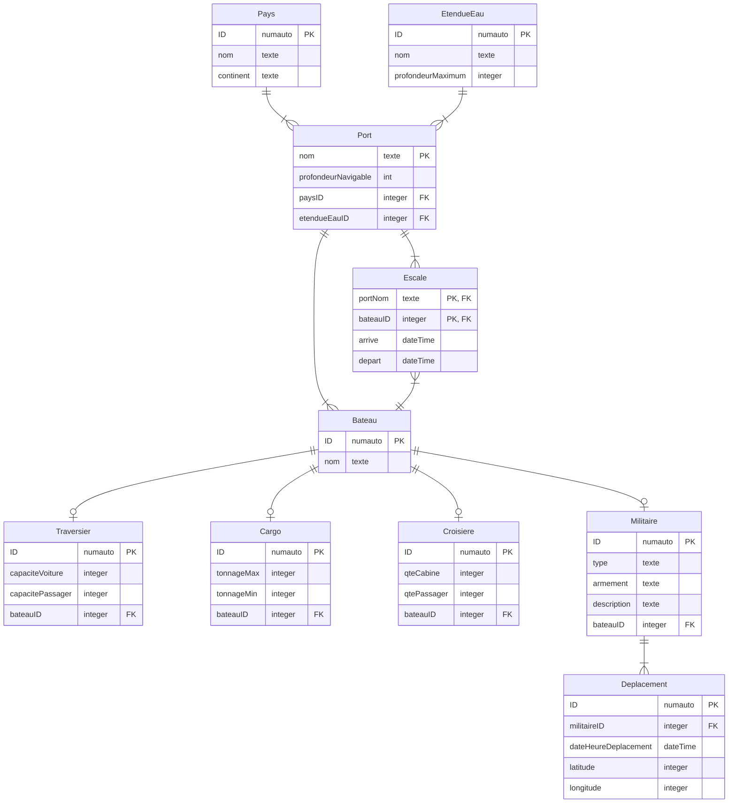

# Numéro 3

```mermaid
erDiagram
    Pays ||--|{ Port : ""
    EtendueEau ||--|{ Port : ""
    Port ||--|{ Bateau : ""
    Port ||--|{ Escale : ""
    Escale }|--|| Bateau : ""
    Bateau ||--o| Traversier : ""
    Bateau ||--o| Cargo : ""
    Bateau ||--o| Croisiere : ""
    Bateau ||--o| Militaire : ""
    Militaire ||--|{ Deplacement : ""
    Pays {
        ID numauto PK
        nom texte
        continent texte
    }
    EtendueEau {
        ID numauto PK
        nom texte
        profondeurMaximum integer
    }
    Port {
        nom texte PK
        profondeurNavigable int
        paysID integer FK
        etendueEauID integer FK
    }
    Bateau {
        ID numauto PK
        nom texte
    }
    Escale {
        portNom texte "PK, FK"
        bateauID integer "PK, FK"
        arrive dateTime
        depart dateTime
    }
    Traversier {
        ID numauto PK
        capaciteVoiture integer
        capacitePassager integer
        bateauID integer FK
    }
    Cargo {
        ID numauto PK
        tonnageMax integer
        tonnageMin integer
        bateauID integer FK
    }
    Croisiere {
        ID numauto PK
        qteCabine integer
        qtePassager integer
        bateauID integer FK
    }
    Militaire {
        ID numauto PK
        type texte
        armement texte
        description texte
        bateauID integer FK
    }
    Deplacement {
        ID numauto PK
        militaireID integer FK
        dateHeureDeplacement dateTime
        latitude integer
        longitude integer
    }
```