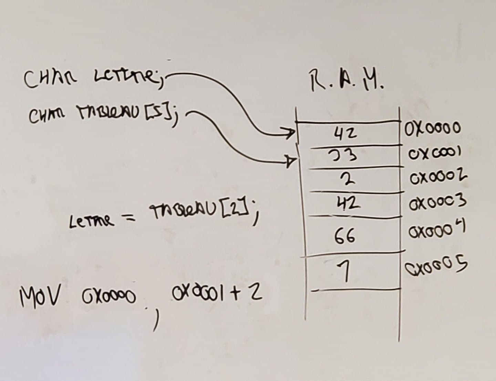

# Revision exam 01

## Systeme de numerotation

-   Conversion (binaire <-> decimal)
-   Representation (boolean = 0/1, char = ascii, entier, unsigned/signed)
-   Plage de valeurs (entier)
    -   Signer: 2^7 -128 - 128
    -   Non-Signer: 2^8 255 - 255
-   Boutisme
    -   ordre des instructions

## Machine (theorique)

-   Uniter systemes (cpu, ram) RAM: addresse memoire ascosier a des octets
-   Registres (ip, sp, ss, cs, ds)
-   Instructions (instructions set, opcode)

## Execution d'un programme

-   Processus de compilation
-   Chargeur
-   Assembleur (xor, mov, push, pop, call, ret) Trace

### Processus


### Trace


## Pointeur

-   Declaration

```c
int entier; // contient une valeur entiere
int\* pEntier; // contient une adresse en ram ou se trouve un entier
```

-   Allocation:

```c
pEntier = malloc(sizeof(int));
```

-   Liberation:

```c
free(pEntier);
```

-   Uilisation
-   Déférencement:

```c
pEntier = &entier;
```

-   Indirection:

```c
*pEntier = 42;
```

-   Tableau et chaine de caracteres



## Structure de donnees

-   Pile
    -   Type: LIFO
    -   Fonctionnalités : empiler (push) et depiler (pop)
-   File
    -   Type: FIFO
    -   Fonctionnalités : enfiler (push) et defiler (pop)
    -   Enfiler: tableau [(frontIndex + compte) % sizeTab] = data;
    -   Defiler: frontIndex = frontIndex++ % sizeTab;
-   Implementation
-   Utilisation

## Securité

-   Glossaire (documentaire stuxnet)
-   Execution d'un programme (vulnerabilité)
-   Chaine de caracteres (vulnerabilité) bufferoverload, string visible
