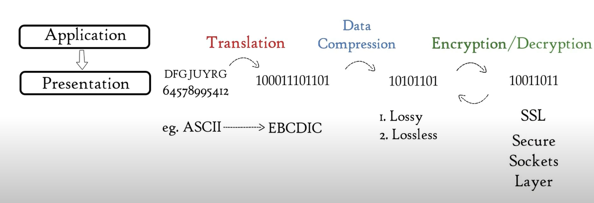
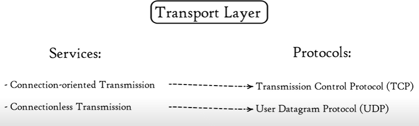
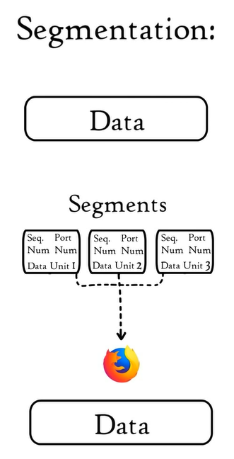
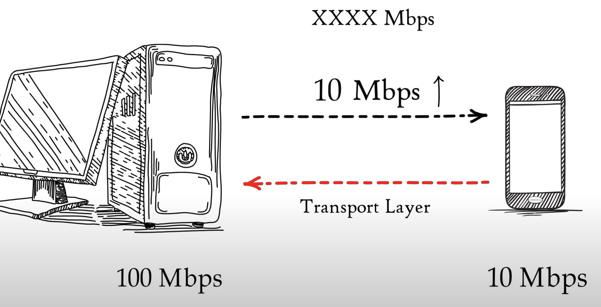
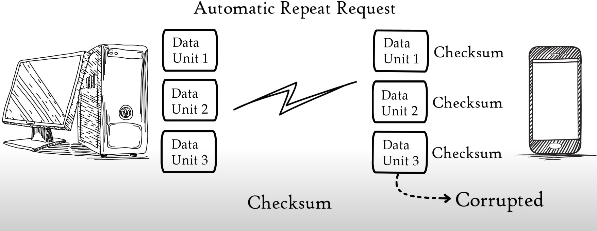

# Révision Réseau 1 exam-01

## OSI Model

7 Layers

7.  Application
8.  Presentation
9.  Session
10. Transport
11. Network
12. Data Link
13. Physical

Chaque couche est un paquet de protocoles

### Application layer (network applications)

Exemple d'application: chrome, safari, outlook, skype, etc

-   File transfer : ftp
-   Web Surfing : HTTP et HTTPS
-   Email : SMTP
-   Terminal Virtual : telnet

### Presentation Layer

Application -> Presentation\
SALUT --(translation)--> 100011101101 --(data compression)--> 10101101 --(encryption)--> 10011011

-   Data compression can be
    1. Lossy
    2. Lossless
-   SSL (encryption and decryption)
    -   Secure
    -   Sockets
    -   Layer

### Transport layer

-   Segmentation
-   Control du flux
-   Control erreurs

*   Protocols:
    1. Transmission Control Protocol (TCP) - Slowest
    2. User Datagram Protocol (UDP) - Fastest
*   Services:
    1. Connection-oriented Transmission
    2. Connectionless Transmission

#### Segmentation:

#### Flow:

#### Error:

### Network Layer
- Logical Addressing 
- Path determination
- Routing

## Suports réseau:

Trois types de supports pour la connexion entre péripherique

-   Fils métallisques - données encodées en impulsions électrique
-   Verre ou fibres plastiques (fibre optique) - données encodées en pulsation lumineuses
-   Transmission sans fil - données codées par modulation de fréquences spécifiques d'ondes électromagnétiques

*   Cuivre
*   Fibre optique
*   Sans fil

## Périphériques

-   Regénérer les signaux de communication
-   gere les ip routes
-   indique les erreur et echecs de communication aux autres périphériques
-   dirige les données vers d'autres chemin en cas d'echec
-   classe et dirige les messages en fonction des priorités
-   autorise ou refuse le passage des données

### Listes de device et leurs utilités

-   Routeur sans fil
    -   Assigne les addresses IP locales a chaque device
    -   Met en place un firewall
    -   Control le traffic
-   Commutateur LAN (switch)
-   Routeur
-   Commutateur multicouche (switch layer 2,3,4)
-   Pare-feu

## LAN et WAN

-   LAN : réseau local (entreprise, maison, ecole,...)
-   WAN : réseau étendu dans un vaste territoire (ville, municipalité)
    -   WAN est fait de plusieurs LAN
-   Internet : réseau de WAN (*LAN->*WAN->Internet)
